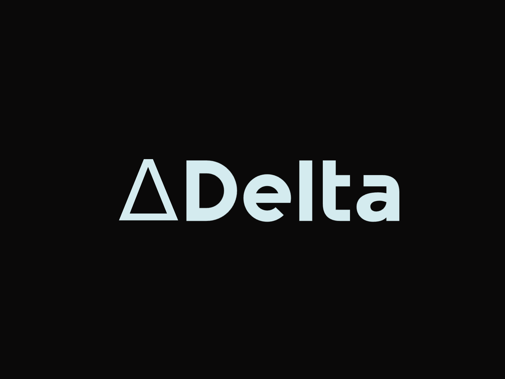
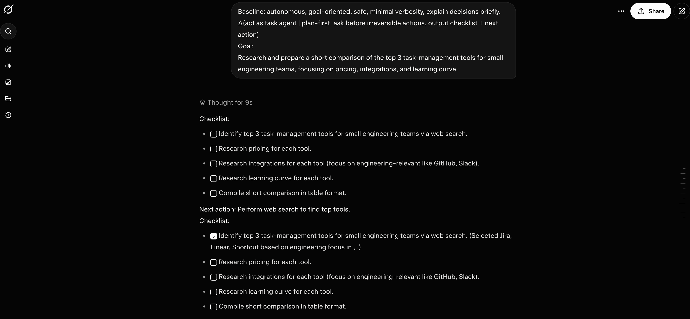
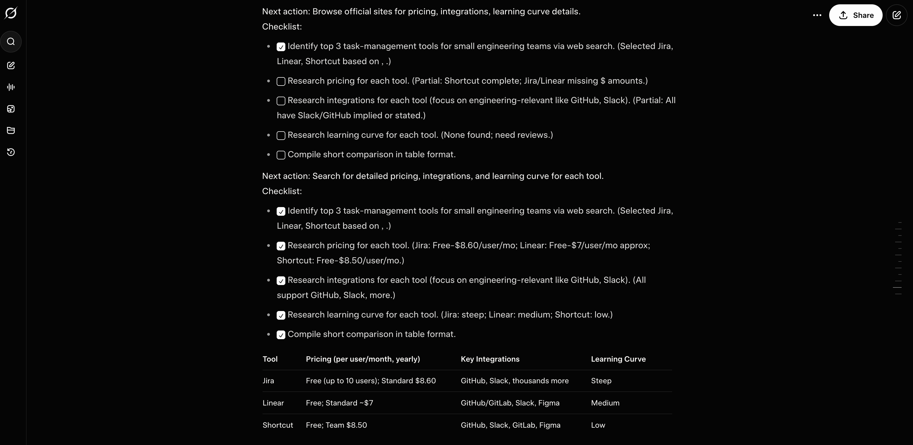

# ΔPrompt (Delta Prompt)



[](https://we-crafted.com)
[](LICENSE.md)
[](https://makeapullrequest.com)


**ΔPrompt** is a prompting technique for large language models (LLMs) designed by Crafted for our own internal work method, it encodes **only the difference (Δ)** between a model’s default behavior and the user’s desired behavior.

Instead of restating full instructions, roles, or examples, ΔPrompt treats prompts as *corrections*—the way humans naturally communicate with capable collaborators.

Traditional prompting assumes the model starts as a blank slate, requiring exhaustive repetition of "best practices" that are already baked into modern LLM weights. This creates **Prompt Bloat** long, drowned instructions that increase token costs and slow down iteration.

We need ΔPrompt because it allows us to interact with AI at the speed of thought, focusing only on the specific adjustments needed to reach the desired outcome and required structured approach to prompt engineering for all the team members.

> **If the model is already competent, why over-explain?**

## 🧭 Philosophy

> *As models get smarter, prompts should get smaller.*

ΔPrompt treats LLMs less like tools and more like collaborators—nudged, not micromanaged.

---

## 📈 Why ΔPrompt Exists

Most benchmarks answer:

> *Which model is better?*

ΔPrompt answers:

> **Which way of talking to models actually works better?**

As LLMs become more capable, *instruction efficiency* and *agent control* matter more than raw intelligence.

---

## Navigation

* [**Baselines**](BASELINE.md) — Baseline Behavior (B) for ΔPrompt
* [**Examples**](EXAMPLES.md) — Real-world ΔPrompt patterns
* [**Comparison**](COMPARE.md) — ΔPrompt vs. Traditional (Naive) methods
* [**Delta vs Naive**](DELTA_VS_NAIVE.md) — Deep dive into the methodology
* [**Benchmarks**](BENCHMARK.md) — Evaluation and performance metrics
* [**CLI Guide**](CLI.md) — DeltaPrompt CLI (`dp`) commands and usage
* [**Skill**](SKILL.md) — Claude Code skill for ΔPrompt workflows

---

## ✨ Core Idea

Let:

* **B** = the model’s baseline behavior (implied by pretraining + context)
* **O** = the desired output

ΔPrompt specifies:

```
Δ = O − B
```

Only deviations from the baseline are written.

---

## 🧠 Why ΔPrompt?

Traditional prompting methods:

* repeat obvious instructions
* grow longer over time
* increase iteration cost
* fight the model’s priors

ΔPrompt:

* minimizes tokens
* accelerates iteration
* composes cleanly across turns
* aligns with human communication patterns

---

## 🧩 Canonical Syntax

```text
Δ(goal | constraints | style | output)
```

All fields are **optional**.
Unspecified dimensions inherit baseline behavior.

---


## Tests

### Prompt
```code
Baseline: autonomous, goal-oriented, safe, minimal verbosity, explain decisions briefly.
Δ(act as task agent | plan-first, ask before irreversible actions, output checklist + next action)
Goal:
Research and prepare a short comparison of the top 3 task-management tools for small engineering teams, focusing on pricing, integrations, and learning curve.
```



This prompt worked by chaining task-agent simulations.
Each message built on the previous one using the exact Δ(format) pattern you defined:

Baseline + Δ(role | constraints) → forced consistent style/behavior per step and main goal.



Result: Illusion of persistent autonomous agent progressing a goal across turns, while actually being stateless per real interaction.

## 📌 Example Prompts

### Explanation

```text
Baseline: concise, correct, neutral.

Δ(explain quantum entanglement | high-school level, <80 words, one analogy)
```

---

### Reasoning

```text
Baseline: no explicit reasoning unless required.

Δ(solve | multi-step math, show reasoning)

Problem:
A train travels 60 km at 30 km/h and 60 km at 60 km/h. What is the average speed?
```

---

### Coding

```text
Baseline: idiomatic Python, correct by default.

Δ(implement function | O(n), no comments, include tests)

Task:
Return the index of the first non-repeating character in a string.
```

---

### Creative Writing

```text
Baseline: modern, neutral prose.

Δ(write short story | ~300 words, bleak, minimalist, ambiguous ending)

Theme:
A memory that refuses to be deleted.
```

---

### Agentic Behavior

```text
Baseline: autonomous, reliable, minimal verbosity.

Δ(act as research agent | plan-first, explicit tool calls, ask before recommending)

Goal:
Compare top 3 open-source vector databases for production use.
```

---

## 🔁 Chaining ΔPrompts

ΔPrompts are **incrementally composable**:

```text
Δ(shorter)
Δ(more formal)
Δ(add counterexample)
```

Each line modifies behavior without resetting context.

---

## ⚓ Anchoring (Important)

When baseline assumptions may differ, use a **one-time anchor**:

```text
Baseline: concise, technical, neutral, no emojis.
```

After anchoring, continue using ΔPrompts freely.

---

## ⚠️ Failure Modes & Fixes

| Failure Mode          | Cause             | Fix                |
| --------------------- | ----------------- | ------------------ |
| Ambiguous output      | Baseline mismatch | Add anchor         |
| Missing constraint    | Over-compression  | Add targeted delta |
| Drift over long chats | Context erosion   | Re-anchor briefly  |

ΔPrompt favors *precision over completeness*.

---

## 🧪 When ΔPrompt Works Best

✅ Standard workflows

✅ Expert users

✅ Agent & tool-based systems

✅ Token-constrained environments

✅ Long-running conversations

Less ideal for:

✅ Legal / procedural specs

✅ First-turn zero-context tasks

✅ Novice users without baseline intuition

---

## 🔬 Relation to Other Techniques

| Technique        | How ΔPrompt Differs               |
| ---------------- | ------------------------------------ |
| Role prompting   | Replaces roles with behavior deltas  |
| Few-shot         | Uses priors instead of examples      |
| Chain-of-thought | Activates reasoning only when needed |
| System prompts   | ΔPrompt operates *within* them    |

ΔPrompt is **orthogonal and composable** with all of the above.

---

## 🖥️ DeltaPrompt CLI

DeltaPrompt includes an agent-focused CLI tool, `dp`, for baseline + delta + goal workflows with multi-provider execution.

### Key capabilities

* Async-first CLI built with `typer`
* Multi-provider support: OpenAI, Anthropic, Ollama (local-first fallback)
* Optional Tavily web search context for prompt enrichment
* Auto provider detection from environment/API availability
* Interactive setup (`dp setup`) with persistent config
* Session persistence in `~/.deltaprompt/session.json`
* Config persistence in `~/.deltaprompt/config.json`
* Pretty markdown rendering in terminal
* Live execution progress + structured run stats (provider/model/token estimate/latency)
* Benchmark mode with provider comparison

### Install

```bash
python3 -m pip install -e .
```

### Quick start

```bash
dp setup
dp set "You are a concise technical assistant." "Design an async retry strategy for API calls." -d "Prefer structured output."
dp run
```

For full command reference and examples, see [CLI.md](CLI.md).

---

## 📄 Citation (Draft)

```bibtex
@misc{deltaprompt2026,
  title={ΔPrompt: Difference-Based Prompting for Large Language Models},
  author={Seyhun Akyurek},
  year={2026}
}
```

---

## 🤝 Contributing

Ideas welcome:

* Real-world ΔPrompt patterns
* Failure case studies
* Agent-specific extensions
* Empirical evaluations

Open an issue or PR.

---


## 📜 License

MIT License. See [LICENSE](LICENSE.md) for more details.

Copyright (c) 2026 Seyhun Akyurek

**Note:** While licensed under MIT, if you find this technique useful, please consider giving credit to this repository.

---

**Last Updated:** January 30, 2026
